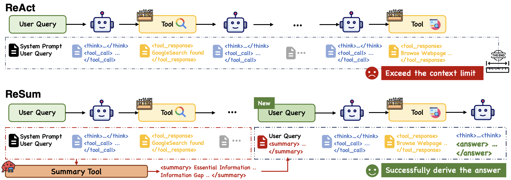

# ReSum: Unlocking Long-Horizon Search Intelligence via Context Summarization


## 🏅 Introduction



We introduce **ReSum**, a novel inference paradigm that enables **unlimited exploration** for web agents. Unlike the classic ReAct paradigm, which appends all interaction history, ReSum periodically compresses conversations into compact, restartable reasoning states. This approach minimizes modifications to ReAct, avoiding additional architectural complexity while ensuring **simplicity, efficiency, and plug-and-play compatibility** with existing agents. The tailored **ReSum-GRPO** algorithm allows for a **～10% performance boost with only 1K training samples** 👑

### Our detailed contributions:

- **ReSumTool-30B**: A specialized summarization model designed to extract key evidence, identify information gaps, and highlight next-step directions for continued exploration. This lightweight, open-source tool enables goal-oriented conversation compression tailored for web search contexts.
  
- **ReSum-GRPO**: A tailored algorithm for paradigm adaptation. ReSum-GRPO segments long trajectories and broadcasts trajectory-level advantages across all segments. With just 1K training samples, our ReSum-GRPO-trained WebSailor-30B-A3B achieves **33.3% Pass@1** on BrowseComp-zh and **18.3% on BrowseComp-en**, outperforming most open-source web agents.


## 🚀 Performance Highlights 

1. **Universal Compatibility**: Direct application of the ReSum paradigm across three WebSailor agents achieves **4.5% average Pass@1 improvement**, demonstrating broad applicability.
2. **Specialized Summarization**: Our developed ReSumTool-30B achieves performance comparable to significantly larger models like Qwen3-235B and DeepSeek-R1-671B when serving as the summary tool, while maintaining lightweight deployment advantages.
3. **Effectiveness of Targeted RL Training**: The tailored ReSum-GRPO algorithm achieves higher training rewards and faster convergence compared to standard GRPO. Such paradigm-adapted reinforcement learning enables agents to reach **8.2% absolute improvement**.


## 🔧 Quick Start 

### Step 0 - Environment 

```
sglang[all]
qwen-agent[gui,rag,code_interpreter,mcp]
```


### Step 1 - Prepare models

Running the ReSum inference requires three models: **inference model**, **summary model for `visit`**, and **summary tool** (e.g., ReSumTool-30B). Download these models and set their paths in either `src/run_react.sh` or `src/run_resum.sh`.

> 🎉 Our ReSumTool-30B will be released soon, specializing in conversation summarization for web search contexts.


### Step 2 - Prepare dataset 

We provide a sample example.jsonl in `src/eval_data` to prevent test data leakage. Download the following official benchmarks and save them in the same folder with the listed filenames, following the exact JSONL format of example.jsonl:

* browsecomp_en.jsonl
* browsecomp_zh.jsonl
* gaia.jsonl


### Step 3 - Inference with tools 

Before running the code, obtain valid API keys for search and visit tools. The search tool requires a Google Search API key from [Serper](https://serper.dev/), and the visit tool requires a Jina API key from [Jina](https://r.jina.ai). Configure the keys in the scripts.

With the keys in hand, remember to correctly set the model paths in Step 1. You can run the ReAct inference from `src/run_react.sh` or ReSum inference from `src/run_resum.sh`.

An example command is provided below. Simply set the inference model path, the name of the evaluated dataset, and the output path. Additionally, you can adjust various hyperparameters in the scripts, such as the maximum context (`MAX_CONTEXT`) and the maximum number of tool calls per run (`MAX_LLM_CALL_PER_RUN`).

```shell
cd src 
bash run_resum.sh MODEL_PATH browsecomp_zh OUTPUT_PATH
```


### Step 4 - Evaluation 

With the inference files (usually in the format `OUTPUT_PATH/MODEL_NAME_sglang/DATASET/iter*.jsonl`), set up the base folder for these rollouts and the dataset name. You'll need a valid DASHSCOPE API key, as we use Qwen2.5-72B-Instruct as the judging model, which can be replaced with your own model and method.

```shell
python3 evaluate.py --dataset $DATASET --input_folder $FOLDER
```


## 📚 Citation 

If you find ReSum useful, please kindly cite as:

```bibtex
@article{wu2025resumun,
   title={ReSum: Unlocking Long-Horizon Search Intelligence via Context Summarization}, 
   author={Xixi Wu and Kuan Li and Yida Zhao and Liwen Zhang and Litu Ou and Huifeng Yin and Zhongwang Zhang and Yong Jiang and Pengjun Xie and Fei Huang and Minhao Cheng and Shuai Wang and Hong Cheng and Jingren Zhou},
   year={2025},
   journal={arXiv preprint arXiv:2509.13313},
}
```
