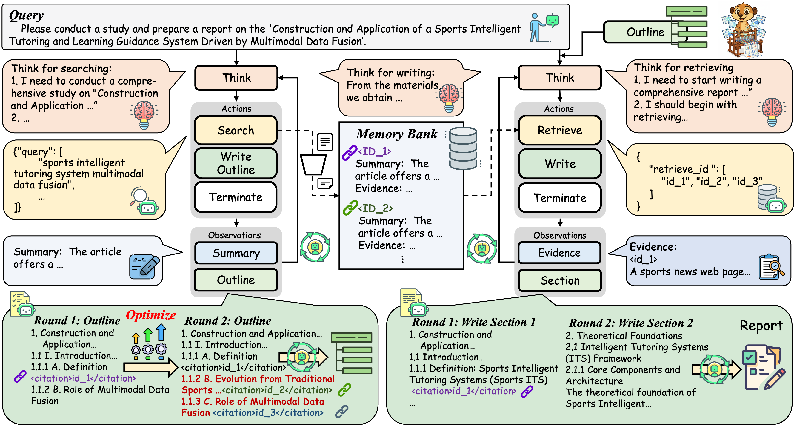
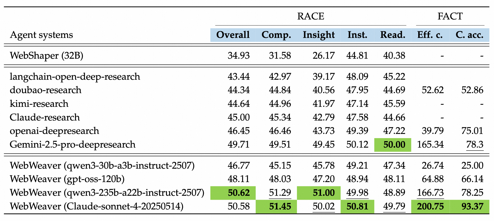
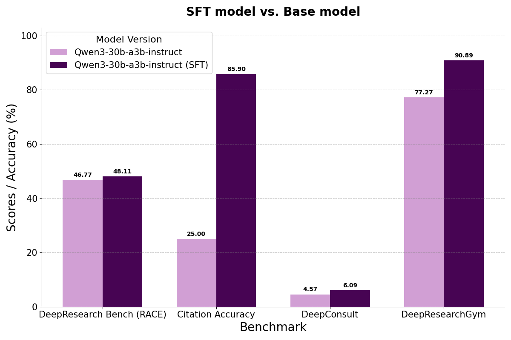

## WebWeaver: Structuring Web-Scale Evidence with Dynamic Outlines for Open-Ended Deep Research


<p align="center">
  
  &nbsp;
  
</p>

Performance of varying deep research agents on DeepResearch Bench, DeepConsult, and DeepResearchGym. The results on DeepResearch Bench are taken from the official leaderboard. WebWeaver achieves state-of-the-art performance.




## 🎓Features

🤝🤖 **Human-Centric Dual-Agent Framework**: We introduce WebWeaver, a novel dual-agent framework that operationalizes the organic process of human research. By dividing labor between a planner (for exploration and outlining) and a writer (for synthesis), our system abandons rigid pipelines in favor of a more flexible and effective methodology.

🔄📚 **Dynamic Outline Optimization**: A core innovation is the agent's ability to treat the research outline as a "living document." Unlike static approaches, the planner operates in a continuous loop, interleaving web searches with outline refinement. This allows the research direction to evolve dynamically based on new discoveries, preventing "fossilization" and enabling genuine exploration.

🗂️🎯 **Memory-Grounded Hierarchical Synthesis**: To overcome the critical challenges of long-context limitations and "loss in the middle," the writer agent constructs the report section-by-section. For each part, it performs targeted retrieval from a curated memory bank, using only the most pertinent, pre-cited evidence. This ensures the final report is coherent, accurate, and deeply grounded in its sources.

🏆 **State-of-the-Art Performance on OEDR**: WebWeaver sets a new state-of-the-art by significantly outperforming existing proprietary and open-source agents on three challenging open-ended deep research benchmarks. This empirically validates that our human-inspired approach is more effective for tackling complex, open-ended knowledge work.

🌐🧠 **Democratizing Expertise with WebWeaver-3k**: To broaden the impact of our work, we create WebWeaver-3k, a high-quality supervised fine-tuning (SFT) dataset. Our experiments show that this dataset can distill the complex skills of our framework into smaller, more accessible models, enabling them to achieve expert-level research capabilities previously limited to large, proprietary systems.

## Performance Highlights


1. Detailed Performance of agents on DeepResearch Bench in terms of comprehensiveness (Comp.), insight, instruction-following (Inst.), readability (Read.), effective citations (Eff. c.), and citation accuracy (C. acc.). WebWeaver outperforms all other agent systems on most of the metrics.


<p align="center">
  
</p>

2. WebWeaver-3k enables a small model to achieve expert-level performance. 


<p align="center">
  
</p>


## 🚀 Getting Started
This requires at least 4*80G GPUs for serving the summary model. You need to prepare a summary model in hf format and API keys for tools as following. Several examples generated by qwen3-256b-a30b-Instruct are provided in `examples` folder. 

You can change to other prompts, search sources, and web page reading tools by yourself for better adaptation perfomance on your own tasks. Please note that the planner and writer require a powerful model to ensure the tool calling performance under long context and long turns. Some poor models may cause the tool calling failure and the performance degradation. We here provide a basic implementation with `qwen3-256b-a30b-Instruct` for the planner and writer here, and you can try other powerful models for better performance.


### 🔧  Installation
```bash
conda create -n webweaver python=3.12
cd tool
pip install redis_for_sdk-0.1.0-py3-none-any.whl
pip install vllm==0.10.2
pip install modelscope
```

### 🔧 Tool requirements
- **SERPER_KEY_ID**: Get your key from Serper.dev for web search and Google Scholar.
- **SCRAPER_API_KEY**: Get your key from [scraperapi](https://dashboard.scraperapi.com/home) for web page reading.
- **DASHSCOPE_API_KEY**: Get your key from [Dashscope](https://dashscope.aliyun.com/) for planning and writing.
- **SUMMARY_MODEL_PATH**: The model path of the summary model (hf format). We recommend to use at least qwen3-30b or gpt-oss-120b model as the summary model to ensure the quality of the summary.


### 📊 Data
We provide a sample data in `eval_data/sample.jsonl`. You can replace it with your own data.

### 📝 Run Planner
```bash
### vllm server for the summary model. We recommend to use at least qwen3-30b model as the summary model to ensure the quality of the summary. Set up the SUMMARY_MODEL_PATH in run_vllm_search.sh.

bash run_vllm_search.sh

### start planning, you need to set up the environment variables: planning model path, search api (SCRAPER_API_KEY), and api keys in run_search.sh. The output jsonl contain following fields:
# {
#     "question": question,
#     "answer": answer,  ## the reference answer, may be empty
#     "search_messages": messages, ## the messages of the search agent
#     "outline": outline, ## the final outline of the research
#     "outline_token": token_count, ## the token count of the outline
#     "termination": termination,
#     "output_token": 0,
#     "token_num_list": token_num_list, ## the token count of the search messages
#     "writer_model": model, ## the model of the planner
#     "page_info": page_info, ## the page info in the memory (summary and evidence)
#     "url2id": url2id, ## the url2id mapping
#     "search_num": search_num, ## the step number of search
# }
bash run_search.sh
```

### 📝 Run Writer
```bash

### start writing, you need to set up the environment variables: writing model and api keys. The output jsonl contain following fields:
# {	
#     "question": question,	
#     "answer": answer,	 ## the reference answer, may be empty
#     "infer_messages": infer_messages,	 ## the messages of the writer
#     "writer_prediction": writer_prediction,	 ## the final report
#     "termination": termination,	
#     "url2id": url2id,	
#     "url2summary": url2summary,	 ## the url2summary mapping
#     "url2page": url2page,	 ## the url2evidence mapping
#     "outline": data['item']['outline'],	
#     "output_token": token_count,	 ## the token count of the final report
#     "token_num_list": token_num_list,	 ## the token count of each step
#     "writer_model": model,	 ## the model of the writer
# }	

bash run_write.sh
```


## 📑 Citation

If this work is helpful, please kindly cite our paper as:

```bibtex
@misc{li2025webweaverstructuringwebscaleevidence,
      title={WebWeaver: Structuring Web-Scale Evidence with Dynamic Outlines for Open-Ended Deep Research}, 
      author={Zijian Li and Xin Guan and Bo Zhang and Shen Huang and Houquan Zhou and Shaopeng Lai and Ming Yan and Yong Jiang and Pengjun Xie and Fei Huang and Jun Zhang and Jingren Zhou},
      year={2025},
      eprint={2509.13312},
      archivePrefix={arXiv},
      primaryClass={cs.CL},
      url={https://arxiv.org/abs/2509.13312}, 
}
```